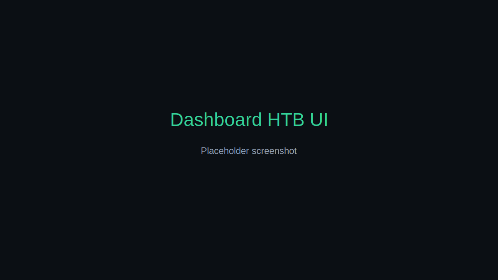
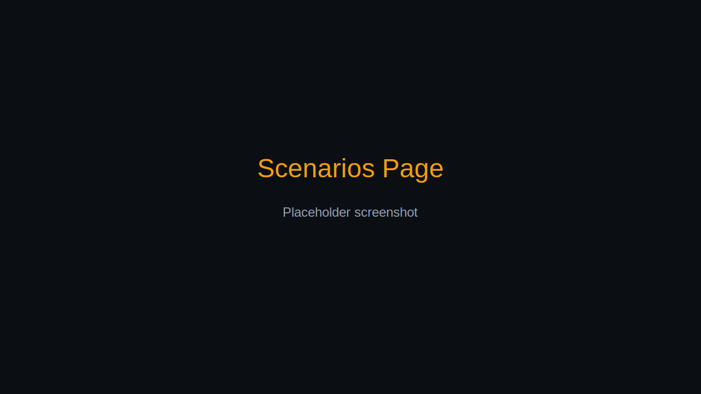
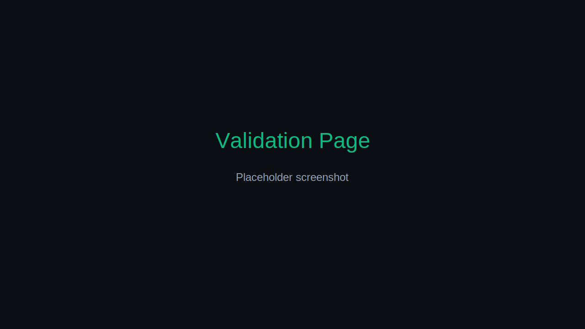
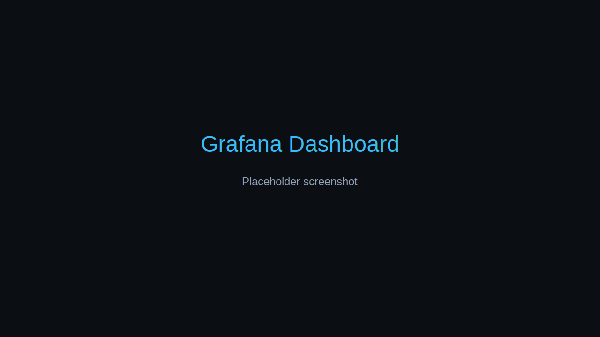
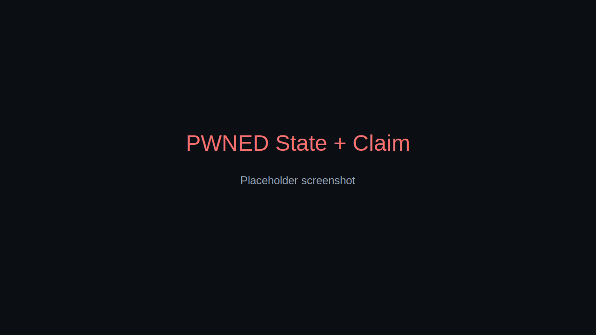

# IT/OT Lab v2

A compact IT/OT training lab with a React portal, FastAPI control plane, and telemetry stack (Prometheus + Loki + Grafana).

## Quick start

```bash
docker compose --profile full up -d
```

Rebuild on changes:

```bash
docker compose --profile full up -d --build portal-api portal-ui
```

## Ports

| Service | URL |
| --- | --- |
| Portal UI | http://localhost:5173 |
| Portal API | http://localhost:8000 |
| Portal API health | http://localhost:8000/api/health |
| Grafana | http://localhost:3000 |
| Prometheus | http://localhost:9500 |
| Loki | http://localhost:3100 |

## Scenarios + expected signals

| Scenario | Expected signals |
| --- | --- |
| sensor_drift | ot_temp_c trending up, alarm logs, ot_events_total(temp_high) |
| valve_stuck | ot_valve_state=0, anomaly logs, ot_events_total(valve_mismatch) |
| comms_jitter | timeout logs, ot_events_total(timeout), metrics still scrape |
| rogue_device | asset logs, ot_events_total(new_device), no major timeseries shift |

## Validation + report + reset

Portal API endpoints:

```bash
curl http://localhost:8000/api/validate
curl http://localhost:8000/api/report
curl -X POST http://localhost:8000/api/lab/reset
```

## Screenshots

> Replace placeholders with real screenshots after running the lab.







## Architecture

See [docs/architecture.md](docs/architecture.md).
